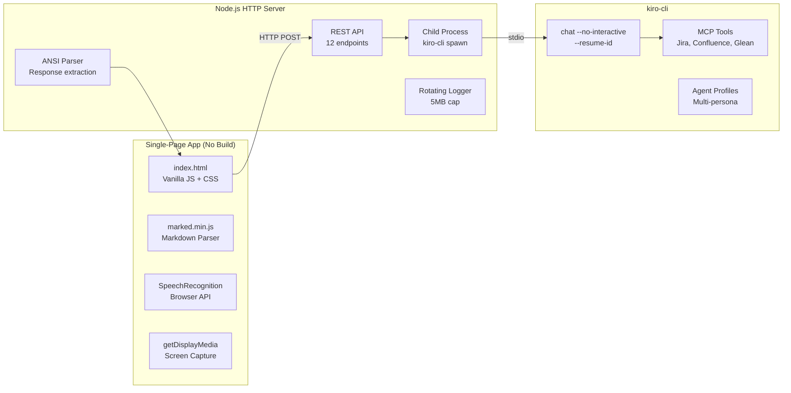

# Kiro Chat UI 💬

> A web-based chat interface for [kiro-cli](https://kiro.dev) — full agent/model switching, file attachments, screen capture, voice input, and session management in a single-page app with zero build step.

   

<!-- 
## Screenshots


-->

---

## Why This Exists

kiro-cli is powerful but terminal-only. This UI wraps it in a modern chat interface — proper markdown rendering, collapsible tool calls, persistent sessions, and multi-modal input (screenshots, files, voice) — all without modifying kiro-cli itself. It's a bridge, not a replacement.

---

## Architecture



---

## Key Features

### 🤖 Multi-Agent Switching
- **List all agents** from kiro-cli registry (global + workspace)
- **Switch mid-conversation** — Changes the `--agent` flag on next message
- **Agent-specific behavior** — Each agent has its own persona, tools, and knowledge

### 🧠 Multi-Model Selection
- **Lists available models** (Claude Opus, Sonnet, Haiku, etc.) with cost multipliers
- **Per-message model selection** — Switch between cheap/fast and expensive/thorough
- **Auto mode** — Server-side model routing (default)

### 📷 Screen Capture & Crop
- **Full screen capture** via `navigator.mediaDevices.getDisplayMedia()`
- **Crop tool** — Select a region of the screenshot before sending
- **Auto-cleanup** — Temporary screenshot files deleted after kiro-cli processes them

### 📎 File Attachments
- **Drag-and-drop** or file picker — any file type
- **Base64 encoding** for images, raw content for text files
- **50MB upload limit** with server-side enforcement
- **Inline prompt injection** — File path appended to prompt for kiro-cli to read

### 🎤 Voice Input
- **Web Speech API** (SpeechRecognition / webkitSpeechRecognition)
- **Real-time transcription** — Speaks directly into the chat input
- **Push-to-talk** or continuous mode

### 💬 Session Management
- **Persistent sessions** — Uses kiro-cli `--resume-id` for conversation continuity
- **Session list** — Searchable sidebar showing all past conversations
- **Session switching** — Click to resume any previous conversation
- **Auto-capture** — First message auto-discovers the new session ID from kiro-cli

### ⚡ Tool Call Visibility
- **Collapsible `<details>` blocks** — See what MCP tools were invoked (Jira, Confluence, Glean)
- **Regex-based extraction** — Parses kiro-cli's tool call output format
- **Clean separation** — Tool metadata doesn't clutter the main response

### 📋 Markdown Rendering
- **Full GitHub-flavored markdown** via `marked.min.js`
- **Code blocks** with language detection and syntax highlighting
- **Tables, lists, links** — Proper rendering of all markdown elements

### 🔍 Slash Commands
Built-in commands: `/clear`, `/export`, `/model`, `/agent`, `/save`, `/use`, `/templates`, `/help`

### 📝 Prompt Templates
- **Save frequently used prompts** — Stored in localStorage
- **Quick-use** — One-click to insert a saved template
- **Manage** — List, create, delete templates

### ⬇️ Export Conversations
- **Download as markdown** — Full conversation with formatting preserved
- **Clean output** — Tool calls and metadata properly formatted

### 🌙 Theme Toggle
- **Dark/Light mode** — CSS custom properties, toggleable
- **Persists in localStorage** — Remembers your preference

### ⌨️ Keyboard Shortcuts
- `Ctrl+K` — Focus search / command palette
- `Ctrl+N` — New conversation
- `Ctrl+/` — Show help

---

## Technical Highlights

| Aspect | Implementation |
|--------|---------------|
| **Zero build step** | Pure HTML + vanilla JS — no webpack, no npm build, just `node server.js` |
| **ANSI parsing** | Custom regex strips terminal escape codes from kiro-cli output |
| **Session discovery** | Runs `kiro-cli chat --list-sessions --format json` to find active session |
| **Process management** | Spawns kiro-cli per-request with `TERM=dumb` to suppress TUI |
| **Log rotation** | Auto-rotates debug.log at 5MB, keeps one backup |
| **File handling** | Temp files in `/tmp/`, auto-cleaned after response |
| **Agent parsing** | Parses `kiro agent list` output to extract agent names (handles ANSI) |
| **Body limit** | 50MB max request body with streaming size check |

---

## API Endpoints

| Method | Path | Description |
|--------|------|-------------|
| POST | `/api/chat` | Send message (with optional file/screenshot) |
| POST | `/api/clear` | Clear current session |
| POST | `/api/set-session` | Switch to specific session |
| POST | `/api/set-model` | Change active model |
| POST | `/api/set-agent` | Change active agent |
| GET | `/api/session-info` | Current session status |
| GET | `/api/sessions` | List all sessions |
| GET | `/api/models` | Available models + cost |
| GET | `/api/agents` | Available agents |
| GET | `/api/whoami` | Current user identity |

---

## Getting Started

### Prerequisites
- Node.js v14+
- kiro-cli installed and authenticated (`kiro-cli login`)

### Run

```bash
git clone https://github.com/AmitendraM/kiro-chat-ui.git
cd kiro-chat-ui
npm install   # No dependencies to install (zero deps)
node server.js
```

Open http://localhost:3000

---

## Design Decisions

- **Vanilla JS over React** — Intentionally zero-dependency frontend. No build tooling, no framework updates, instant load. The entire UI is a single HTML file.
- **HTTP over WebSocket** — kiro-cli doesn't stream partial responses, so request/response is sufficient. Simpler to debug, no connection management.
- **Spawn-per-request** — Each message spawns a fresh kiro-cli process with `--resume-id`. Stateless server, no long-lived processes to manage.
- **TERM=dumb** — Suppresses kiro-cli's TUI rendering (spinners, colors, cursor movement), giving clean parseable output.
- **Vendored marked.min.js** — No CDN dependency, works offline/air-gapped.

---

## License

MIT
